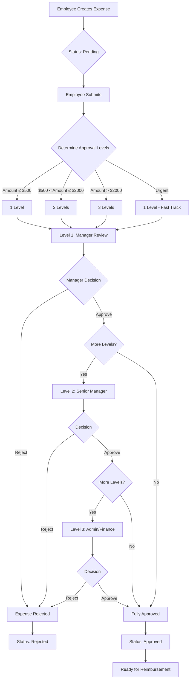
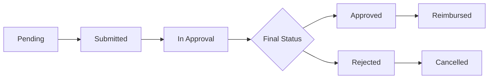
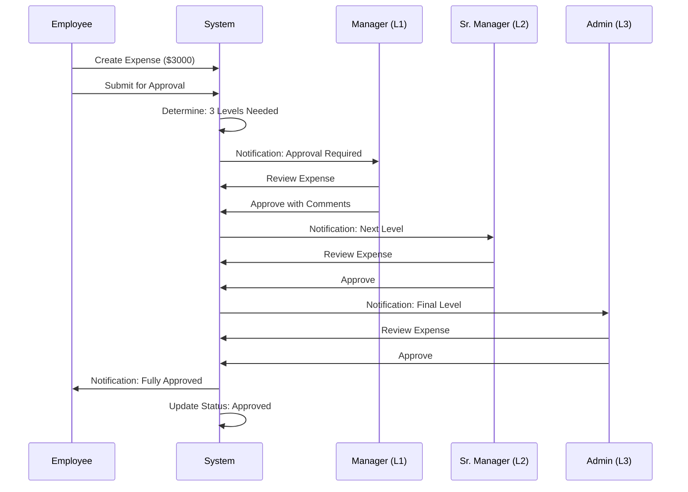
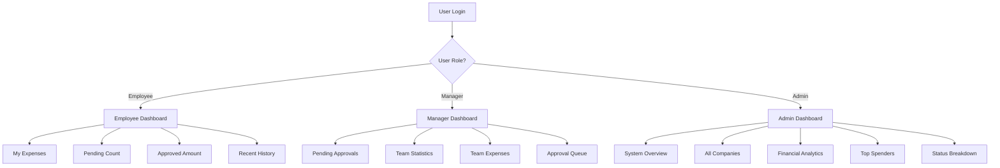
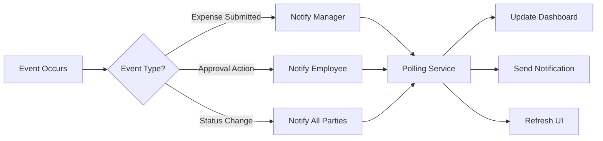
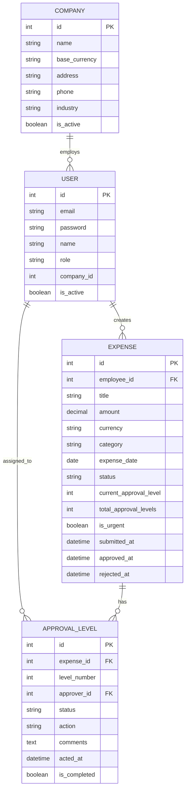
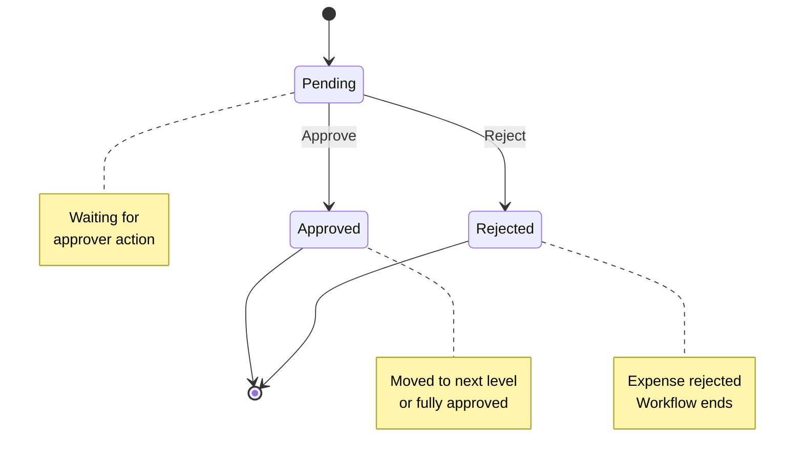
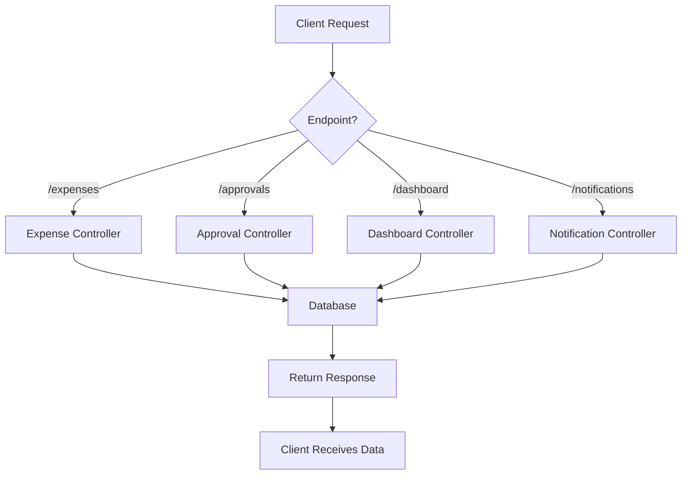

# Approval Workflow Diagram

## Sequential Approval Flow

## Status Flow Diagram

## Multi-Level Approval Example

## Dashboard Data Flow

## Notification System

## Database Schema

## Approval Level States

## Complete Request Flow

